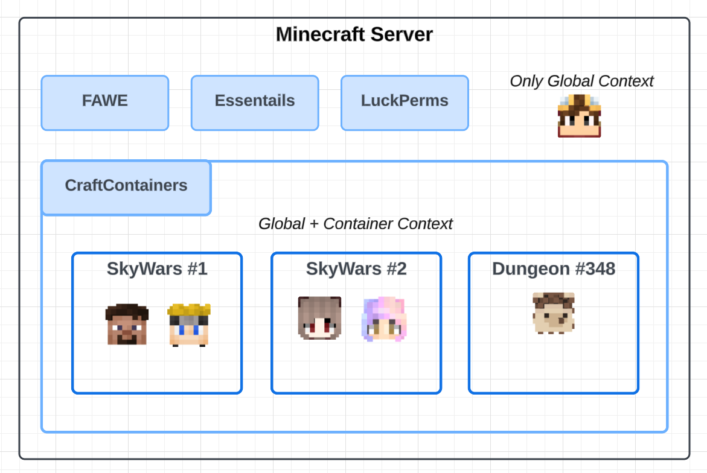
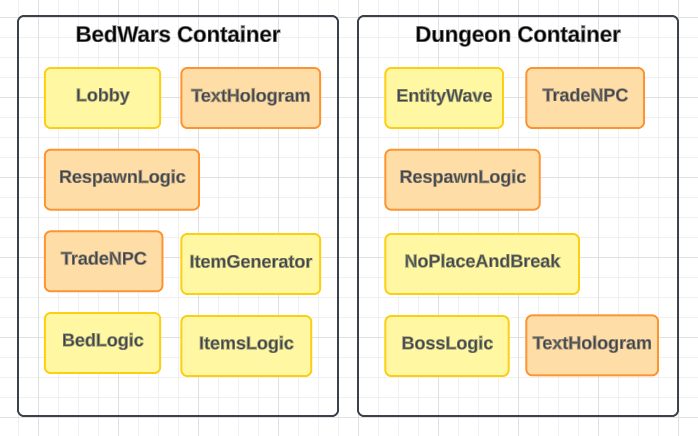

# CraftContainers
Framework umożliwiający tworzenie odizolowanych obszarów z własną logiką, stanem i mapą w serwerze Minecraft, idealny do budowania minigier, dungeonów i innych instancji, które działają niezależnie, a jednocześnie pozostają częścią tego samego serwera.

## Kluczowe zalety

### 🧩 **Modułowe podejście**
Twórz moduły odpowiadające poszczególnym podproblemom, np. system lobby, bossa, logika gry. Każdy moduł można używać wielokrotnie w różnych projektach, co znacznie przyspiesza rozwój i pozwala utrzymać czysty, uporządkowany kod.

{style="width:500px;"}

### 🤝 **Współpraca i community**
Moduły z innych projektów są kompatybilne, co umożliwia łatwe dzielenie się gotowymi rozwiązaniami między programistami. Wspólna praca nad grami staje się prostsza i bardziej efektywna.

### 🏗 **Instancyjność**
Każda gra jest generowana dynamicznie i posiada własny, niezależny stan i mapę. Możesz tworzyć dowolną liczbę instancji tej samej gry bez ograniczeń, a każda z nich działa w pełni autonomicznie.

### 🎮 **Minigry wewnątrz gry**
Minigry działają w głównym kontekście serwera, co pozwala łatwo kontrolować stan graczy, korzystać z istniejących pluginów i funkcji serwera oraz uruchamiać wiele instancji różnych gier równocześnie bez dodatkowych kosztów osobnych instacji serwerów.