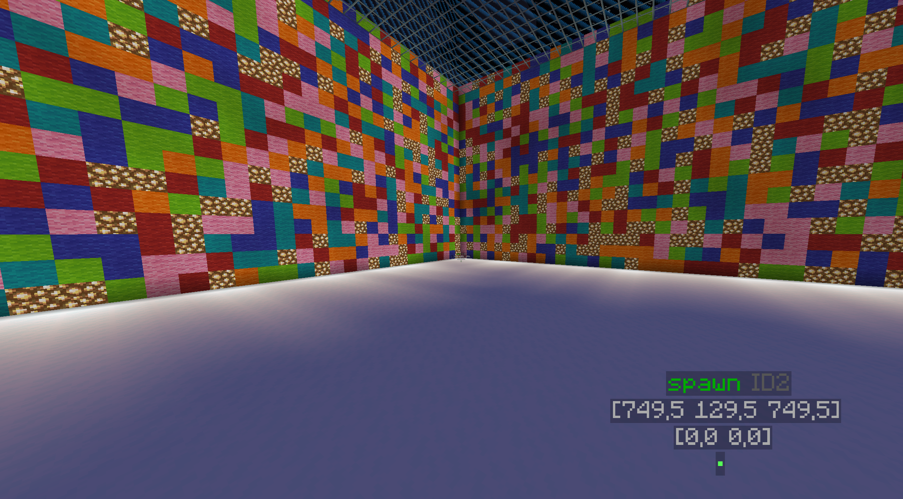

# Szybki start - przykład gry Spleef
Proste wprowadzenie do pracy z CraftContainers.


Funkcjonalności umieszczamy wewnątrz komponentów. 
Każdy komponent posiada wbudowane zdarzenia wewnętrzne, które odpowiadają za różne etapy
cyklu życia oraz interakcję z graczami.

* **onComponentInit()** – Wywoływany automatycznie, gdy komponent zostaje utworzony. Używany do inicjalizacji
  komponentu (np. tworzenie zasobów, uruchamianie wątków, inicjowanie logiki).

* **onComponentDestroy()** – Wywoływany automatycznie, gdy komponent jest wyłączany. Używany do usuwania zasobów i
  elementów stworzonych przez komponent (np. zatrzymywanie wątków, czyszczenie danych).

* **onPlayerInit()** – Wywoływany automatycznie, gdy gracz dołącza do sesji (lub jeśli
  komponent został uruchomiony po dołączeniu gracza). Używany do nadania graczowi właściwości, przenoszenia go na mapę
  itp.

* **onPlayerDestroy()** – Wywoływany automatycznie, gdy gracz opuszcza sesję. Używany do usuwania
  właściwości gracza, które były przypisane na potrzeby sesji (np. usuwanie efektów czy zmiany statusu).

  
## Faza budowania mapy
1. Uruchom edytor schematów: `/blueprint edit simplespleef#mygamemap`
2. Zbuduj prostą arenę spleef według własnego pomysłu.
3. Oznacz kluczowe lokacje na mapie:
  - `/marker givemarkerblock spawn` - postaw blok w miejscu spawn graczy
  - `/marker givemarkerblock pos1` - postaw blok w jednym rogu na wysokości śniegu
  - `/marker givemarkerblock pos2` - postaw blok w przeciwnym rogu na wysokości śniegu
4. Zapisz projekt: `/blueprint save`
5. Opuść edytor: `/blueprint exit`



[Dowiedz się więcej o edytorze Blueprint.](/pl/learn/blueprint.md)


## Klasa odpowiadająca za mapę

[Dowiedz się więcej generowaniu mapy.](/pl/learn/gamemap-generating.md)

```java
public class SpleefGameMap extends GameMap {
    // Pliki wygenerowane w edytorze map (schemat i markery)
    private final static String NAME = "mygamemap";
    // Nazwa pluginu musi być "SimpleSpleef", aby arena była poprawnie rozpoznana
    // (np. jako simplespleef#mygamemap)
    private final static File SCHEMATIC_FILE = ISchematic.getFile(SimpleSpleef.getInstance(), NAME);
    private final static File MARKERS_FILE = IMarkers.getFile(SimpleSpleef.getInstance(), NAME);

    // Schemat mapy i zestaw markerów (np. spawn, strefa eliminacji) 
    // dostosowane do bieżącej instancji gry
    private ISchematic<?> schematic;
    private Markers markers;

    public SpleefGameMap(@NotNull Container container, @NotNull ISpaceAllocator allocator) {
        super(container, allocator);
    }

    public SpleefGameMap(@NotNull Container container) {
        super(container, Allocators.defaultRecyclingAllocator());
    }

    // Generowanie mapy – wstawienie schematu w przestrzeń gry
    @Override
    protected void generate() {
        // Wczytanie schematu mapy i ustawienie go w wyznaczonym obszarze
        schematic = Schematics.newMassive(SCHEMATIC_FILE, space(), center());
        schematic.load();

        // Wczytanie markerów (np. spawn, strefy gry) z pliku
        markers = Markers.read(MARKERS_FILE, center());
    }

    // Czyszczenie mapy - zwykłe usunięcie ternu gdzie był schemat
    @Override
    protected void degenerate() {
        // Allocator przydziela przestrzeń dla GameMap.
        // Jeśli ponownie używa tego samego obszaru, musisz zadbać o jego wyczyszczenie.
        // Aby tego uniknąć, zdefinuj na sztywno allocator, który automatycznie czyści przestrzeń.

        // Sprawdzamy, czy przestrzeń wymaga ręcznego czyszczenia
        if (!space().requiresCleanup()) return;

        // Usunięcie schematu z mapy
        if (schematic != null)
            schematic.clean();
    }

    // Kiedy mapa uruchomi się
    @Override
    public void onComponentInit(ComponentConstructor event) {
        // Pobranie kluczowych lokalizacji z markerów
        var spawn = markers.requireOneLocationByName("spawn");
        var eliminated = markers.requireOneLocationByName("eliminated");
        var pos1 = markers.requireOneLocationByName("pos1");
        var pos2 = markers.requireOneLocationByName("pos2");

        // Uruchomienie logiki gry (rdzenia Spleefa) z użyciem wczytanych punktów
        new SpleefCore(this, spawn, eliminated, pos1, pos2).start();
    }
}
```

## Stan gry
```java
public enum GameState {
    WAITING,
    PLAY,
    REGENERATING
}
```

## Stan gracza

```java
public class SpleefPlayer extends PlayerState {
    private boolean isAlive;
    public SpleefPlayer(Player player, boolean isAlive) {
        super(player);
        this.isAlive = isAlive;
    }

    public boolean isAlive() {
        return isAlive;
    }

    public void setAlive(boolean alive) {
        isAlive = alive;
    }
}
```

## Event handler
[Dowiedz się więcej komunikacji komponentów.](/pl/learn/component-interaction.md)
```java
public interface SpleefEventHandler {
    void invokePlayerEliminated(SpleefPlayer spleefPlayer);
}
```

## Główny rdzeń spleef

```java
@SingletonComponent
public class SpleefCore extends Controller implements SpleefEventHandler {
    private GameState gameState = GameState.WAITING;
    private PlayerManualStorage<SpleefPlayer> spleefPlayers = new PlayerManualStorage<>();

    // Kluczowe lokalizacje areny
    private final Location spawn;
    private final Location eliminated;
    private final Location snowPos1;
    private final Location snowPos2;

    public SpleefCore(@NotNull Component parent,
                      Location spawn,
                      Location eliminated,
                      Location snowPos1,
                      Location snowPos2) {
        super(parent);
        this.spawn = spawn;
        this.eliminated = eliminated;
        this.snowPos1 = snowPos1;
        this.snowPos2 = snowPos2;
    }


    @Override
    public void onComponentInit(ComponentConstructor event) {
        // Oddzielny ekwipunek na czas gry
        new OtherEquipment(this).start();

        // Ustaw oddzielny tryb gry na czas gry.
        new OtherGameMode(this, GameMode.SURVIVAL).start();

        // Oddzielny tryb gry (wszyscy w survivalu)
        new SpleefLogic(this).start();

        // Start w stanie "oczekiwanie na graczy"
        setGameStateWaiting();
    }

    @Override
    public void onPlayerInit(PlayerConstructor event) {
        // Każdy nowy gracz dostaje obiekt SpleefPlayer (domyślnie wyeliminowany)
        var player = event.player();
        spleefPlayers.createOrThrow(player, player1 -> new SpleefPlayer(player1, false));
        player.teleport(eliminated);
    }

    @Override
    public void onPlayerDestroy(PlayerDestructor event) {
        // Usunięcie stanu gracza po opuszczeniu areny
        var player = event.player();
        spleefPlayers.removeOrThrow(player);
    }

    // Daj graczowi łopatę z enchantem Efficiency IV
    public void giveSpleefItems(Player player) {
        var inv = player.getInventory();
        inv.clear();
        var tool = new ItemStack(Material.DIAMOND_SHOVEL);
        var meta = tool.getItemMeta();
        meta.addEnchant(Enchantment.EFFICIENCY, 4, true);
        tool.setItemMeta(meta);
        inv.addItem(tool);
    }

    private void setGameStateWaiting() {
        gameState = GameState.WAITING;

        // Utworzenie lobby (min. 2 graczy)
        var lobby = new Lobby(this, Time.seconds(4), spawn, 32, 2);

        // Po zakończeniu lobby automatyczne przejście do fazy gry
        lobby.getFinalizeEvent().register(this::setGameStatePlay);
        lobby.start();

        // Przeniesienie wszystkich graczy na spawn i wyczyszczenie ekwipunku
        players().forEach(player -> {
            player.teleport(spawn);
            player.getEquipment().clear();
        });
    }

    private void setGameStatePlay() {
        gameState = GameState.PLAY;

        // Wszyscy gracze stają się "żywi"
        spleefPlayers.forEach(spleefPlayer -> spleefPlayer.setAlive(true));
        players().forEach(this::giveSpleefItems);
    }

    private void setGameStateRegenerating() {
        gameState = GameState.REGENERATING;

        runTaskAsync(() -> {
            // Odbudowanie warstwy śniegu w tle (FAWE – bez lagów dla serwera)
            FaweOperations.setBlock(snowPos1, snowPos2, Material.SNOW_BLOCK);
            // Po regeneracji powrót do stanu oczekiwania
            runTask(this::setGameStateWaiting);
        });
    }

    public GameState getGameState() {
        return gameState;
    }

    // Wysokość, poniżej której gracz jest eliminowany
    public int getEliminationY() {
        return snowPos1.getBlockY() - 3;
    }

    public SpleefPlayer getSpleefPlayer(Player player) {
        return spleefPlayers.getOrThrow(player);
    }

    // Wywoływane, gdy gracz zostanie wyeliminowany (przez logikę SpleefLogic)
    @Override
    public void invokePlayerEliminated(SpleefPlayer spleefPlayer) {
        var eliminationMessage = "§c" + spleefPlayer.getPlayer().getName() + " has been eliminated!";
        broadcast(eliminationMessage);

        var remainPlayers = spleefPlayers.stream().filter(sp -> sp.isAlive()).toList();
        if (remainPlayers.size() == 1) {
            var winner = remainPlayers.getFirst();
            var winnerMessage = "§6" + winner.getPlayer().getName() + " has won the game!";
            broadcast(winnerMessage);

            setGameStateRegenerating();
        }
    }
}
```

## Kontroller logiki spleef
[Dowiedz się więcej o filtrowaniu eventów bukkit.](/pl/learn/listeners.md)

```java
// Ten komponent może istnieć tylko raz w danym kontenerze (wiele instancji SpleefLogic nie ma sensu).
@SingletonComponent
// Komponent wymaga aktywnego SpleefCore – bez niego logika gry nie ma zastosowania.
@Dependency(component = SpleefCore.class)
public class SpleefLogic extends Controller {
    public SpleefLogic(@NotNull Component parent) {
        super(parent);
    }

    @Override
    public Listeners defineListeners() {
        // Dodaj listener obsługujący zdarzenia gry
        return super.defineListeners().add(MyListener.class);
    }

    // AdaptedListener to rozszerzony listener Bukkita,
    // pozwalający filtrować zdarzenia w obrębie kontenera.
    // Nigdy nie implementuj Listenera bezpośrednio w komponencie,
    // bo wtedy jedna instancja obsługiwałaby wiele aren.
    private static class MyListener implements AdaptedListener {
        @EventHandler(ignoreCancelled = true)
        public void onBlockPlace(BlockPlaceEvent event) {
            // Każde zdarzenie Bukkit na początku pochodzi z globalnego kontekstu serwera.
            // Aby powiązać je z właściwą areną, musimy odfiltrować je na podstawie gracza.
            // Najpierw pobieramy kontener przypisany do gracza, który wywołał zdarzenie.
            var container = Container.getForPlayer(event.getPlayer());
            // Metoda first(...) uruchamia logikę dla pierwszego komponentu typu SpleefLogic
            // wewnątrz podanego kontenera. Dzięki temu mamy pewność, że zdarzenie zostanie
            // obsłużone tylko w ramach właściwej instancji gry.
            first(container, SpleefLogic.class, spleefLogic -> {
                // Po przefiltrowaniu zdarzenia i upewnieniu się, że dotyczy właściwego
                // kontenera, anulujemy możliwość stawiania bloków na arenie.
                event.setCancelled(true);
            });
        }

        @EventHandler(ignoreCancelled = true)
        public void onBlockBreak(BlockBreakEvent event) {
            var player = event.getPlayer();
            var container = Container.getForPlayer(player);
            first(container, SpleefLogic.class, spleefLogic -> {

                // Ponieważ ustawiliśmy zależność @Dependency(component = SpleefCore.class),
                // możemy pobrać główny komponent SpleefCore i komunikować się z nim.
                //
                // Wskazówka: gdyby ta zależność nie była zadeklarowana, nadal moglibyśmy
                // spróbować go wyszukać, ale wynik mógłby być null.
                var core = spleefLogic.useComponent(SpleefCore.class);
                var spleefPlayer = core.getSpleefPlayer(player);

                // Pozwalamy niszczyć bloki śniegu tylko w trakcie aktywnej gry,
                // pod warunkiem że gracz jest żywy i rzeczywiście niszczy blok śniegu.
                if (event.getBlock().getType() == Material.SNOW_BLOCK && spleefPlayer.isAlive() && core.getGameState() == GameState.PLAY) {
                    event.setDropItems(false);
                    player.getInventory().addItem(new ItemStack(Material.SNOWBALL, 4));
                } else {
                    event.setCancelled(true);
                }
            });
        }

        // Blokujemy możliwość wyrzucania przedmiotów z ekwipunku.
        @EventHandler(ignoreCancelled = true)
        public void onPlayerDropItem(PlayerDropItemEvent event) {
            var container = Container.getForPlayer(event.getPlayer());
            first(container, SpleefLogic.class, spleefLogic -> {
                event.setCancelled(true);
            });
        }


        // Zapobiegamy niszczeniu się przedmiotów poprzez wyzerowanie ich obrażeń.
        @EventHandler(ignoreCancelled = true)
        public void onPlayerItemDamage(PlayerItemDamageEvent event) {
            var container = Container.getForPlayer(event.getPlayer());
            first(container, SpleefLogic.class, spleefLogic -> {
                event.setDamage(0);
            });
        }

        // Wyłączamy możliwość otrzymywania obrażeń przez graczy
        @EventHandler(ignoreCancelled = true)
        public void onEntityDamage(EntityDamageEvent event) {
            if (!(event.getEntity() instanceof Player player)) return;

            var container = Container.getForPlayer(player);
            first(container, SpleefLogic.class, spleefLogic -> {
                event.setDamage(0);
            });
        }


        // Trafienie gracza śnieżką powoduje silne odepchnięcie w kierunku jej lotu.
        @EventHandler(ignoreCancelled = true)
        public void onEntityDamageByEntity(EntityDamageByEntityEvent event) {
            if (!(event.getEntity() instanceof Player victim)) return;
            if (!(event.getDamager() instanceof Snowball snowball)) return;

            var container = Container.getForPlayer(victim);
            first(container, SpleefLogic.class, spleefLogic -> {
                var knockback = snowball.getVelocity().normalize().multiply(1.5);
                victim.setVelocity(knockback);
            });
        }

        // Śnieżki mogą niszczyć bloki śniegu.
        @EventHandler(ignoreCancelled = true)
        public void onProjectileHit(ProjectileHitEvent event) {
            if (!(event.getEntity() instanceof Snowball snowball)) return;
            if (!(snowball.getShooter() instanceof Player player)) return;

            var block = event.getHitBlock();
            if (block == null || block.getType() != Material.SNOW_BLOCK) return;

            var container = Container.getForPlayer(player);
            first(container, SpleefLogic.class, spleefLogic -> {

                var core = spleefLogic.useComponent(SpleefCore.class);
                var spleefPlayer = core.getSpleefPlayer(player);

                // Śnieżki mogą niszczyć bloki śniegu tylko wtedy,
                // gdy gra jest w toku i gracz nie został wyeliminowany.
                if (core.getGameState() != GameState.PLAY || !spleefPlayer.isAlive())
                    return;

                block.setType(Material.AIR);
            });
        }

        // Logika eliminacji gracza.
        @EventHandler(ignoreCancelled = true)
        public void onPlayerMove(PlayerMoveEvent event) {
            var fromY = event.getFrom().getBlockY();
            var toY = event.getTo().getBlockY();
            if (fromY == toY) return;

            var player = event.getPlayer();
            var container = Container.getForPlayer(player);
            first(container, SpleefLogic.class, spleefLogic -> {

                var core = spleefLogic.useComponent(SpleefCore.class);

                // Ignorujemy zdarzenie, jeżeli gracz wciąż znajduje się powyżej
                // poziomu eliminacji (eliminationY).
                if (toY > core.getEliminationY()) return;

                var spleefPlayer = core.getSpleefPlayer(player);

                // Nie eliminujemy gracza, jeśli jest już martwy
                // albo jeśli rozgrywka aktualnie nie trwa.
                if (core.getGameState() != GameState.PLAY || !spleefPlayer.isAlive())
                    return;

                // Oznaczamy gracza jako wyeliminowanego.
                spleefPlayer.setAlive(false);

                // Powiadamiamy wszystkie komponenty obsługujące zdarzenia Spleefa
                // o fakcie eliminacji gracza.
                container.forEachComponents(
                        SpleefEventHandler.class,
                        spleefEventHandler -> spleefEventHandler.invokePlayerEliminated(spleefPlayer));

            });
        }
    }
}
```

## Główna klasa kontenera
```java
public class SpleefContainer extends Container {
    public SpleefContainer(JavaPlugin plugin) {
        super(plugin);
    }

    @Override
    protected @NotNull GameMap defaultBoard() {
        return new SpleefGameMap(this);
    }
}
```

## Uruchamianie
```java
//...
// Tworzenie nowej instancji gry
var spleef = new SpleefContainer(this);
spleef.start();

// Dodawanie gracza do instancji
spleef.addPlayer(player);
```