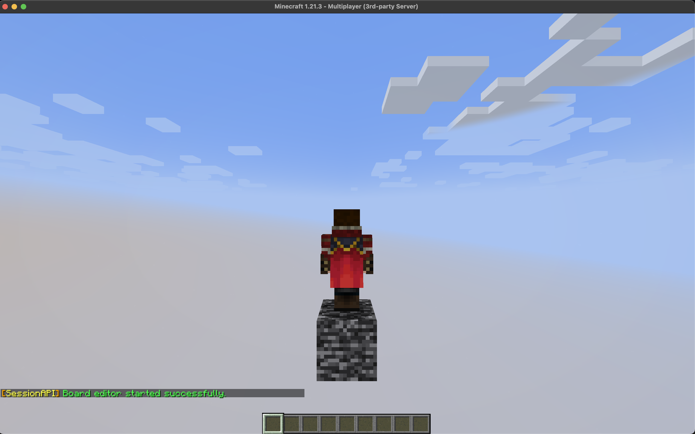
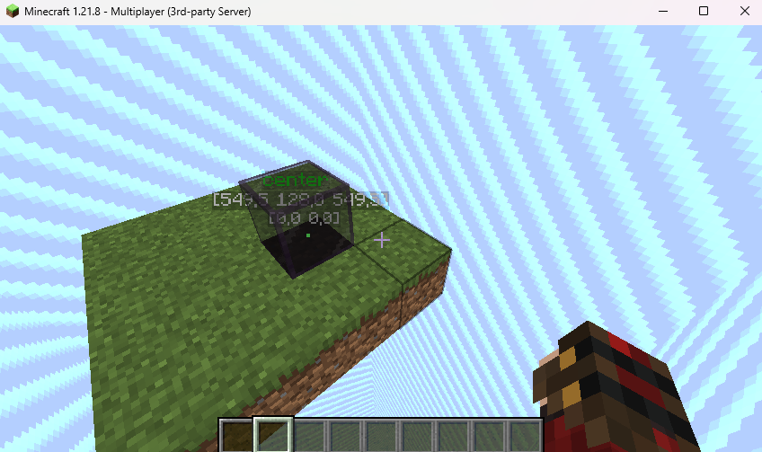
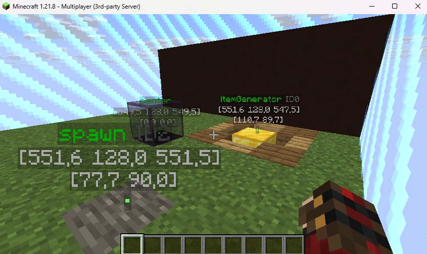

# Kreator Blueprint
Kreator to wbudowane narzędzie umożliwiające modyfikację schematów budowli oraz lokacji kluczowych w schemacie.
Został zaprojektowany tak, aby mógł z niego korzystać każdy, nawet bez umiejętności programowania.
Pozwala na tworzenie nowych szablonów budowli oraz edycję istniejących.

## Komendy

- `/blueprint`
  - `edit <nazwa>` - Opens the editor using an existing schematic or creates a new file.
  - `save` - Saves the currently edited schematic without exiting.
  - `exit` - Exits the editor.
  - `radius <number>` - Sets the maximum size of the schematic. (size = 2*radius-1)
- `/markers`
  - `addhere <nazwa>` - Creates a marker at the player’s current position.
  - `removeid <id> ` - Removes a specific marker by its ID.
  - `removename <name>` - Removes all markers with the specified name.
  - `givemarkerblock <name>` - Gives the player a block that creates a marker at the placement location.
  - `giveclearblock` - Gives a block that deletes markers at the placement location.
  - `list` - Displays all markers grouped by name.
  - `list <name>` - Display all markers in group.
  - `tp <id>` - Teleports the player to the specified marker.


## Zalecany format nazwy szablonu
Aby uniknąć konfliktów między nazwami szablonów oraz łatwo zidentyfikować, z którego pluginu pochodzi dany szablon, stosuj format `<nazwaSzablonu>#nazwaPluginu`.

### Przykład
- `/blueprint edit Arena1#BedWars`
- `/blueprint edit Arena1#DuelsPvP`



Jeśli szablon nie istnieje, zostanie utworzony nowy, domyślny szablon.


## Punkt origin schematu
Origin określa punkt odniesienia, względem którego schemat będzie wklejany do świata.



## Kluczowe lokacje
Kluczowe lokacje to specjalne punkty oznaczone w edytorze, do których można później odwoływać się w kodzie.

### Ustawienie lokacji
Za pomocą komendy `/markers`.


### Pobieranie lokacji
- `@NotNull List<Marker> requireAnyByName(String name)`  
  Wymaga co najmniej jednego markera o podanej nazwie (inaczej wyjątek).

- `@NotNull Marker requireOneByName(String name)`  
  Wymaga dokładnie jednego markera o podanej nazwie (inaczej wyjątek).

- `@NotNull Location requireOneLocationByName(String name)`  
  Wymaga dokładnie jednego markera i zwraca jego lokalizację.

- `@NotNull List<Location> requireAnyLocationsByName(String name)`  
  Wymaga co najmniej jednego markera i zwraca ich lokalizacje.

<details>
  <summary>Pozostałe metody</summary>

- `@NotNull Location getBase()`  
  Zwraca bazową lokalizację według, której zostały wyliczone markery.

- `@NotNull List<Marker> getMarkers()`  
  Pobiera wszystkie istniejące markery.

- `@Nullable Marker getById(int id)`  
  Pobiera marker na podstawie jego identyfikatora lub `null`.

- `@NotNull List<Marker> getByName(String name)`  
  Pobiera wszystkie markery o podanej nazwie (może być pusta lista).

- `@NotNull List<Marker> getNearbyMarkers(Location location, double radius)`  
  Pobiera wszystkie markery w zadanym promieniu od lokalizacji.
</details>

## Statyczne generowanie mapy i pobieranie kluczowych lokalizacji
Aby uruchomić ten przykład, musisz utworzyć blueprint o nazwie `MyGameMap#YourPluginName`.
W blueprintcie powinna istnieć dokładnie jedna lokalizacja `itemGenerator` oraz co najmniej jedna lokalizacja `chest`.

```java
public class MyGameMap extends GameMap {
  private final static String NAME = "MyGameMap";
  private final static File SCHEMATIC_FILE = ISchematic.getFile(YourPlugin.getInstance(), name);
  private final static File MARKERS_FILE = IMarkers.getFile(YourPlugin.getInstance(), name);

  private ISchematic<?> schematic;
  private Markers markers;

  public MyGameMap(@NotNull Container container, ISpaceAllocator allocator) {
    super(container, allocator);
  }

  public MyGameMap(@NotNull Container container) {
    super(container, Allocators.defaultAllocator());
  }

  @Override
  protected void generate() {
    schematic = Schematics.newMassive(schematicFile, space(), center());
    schematic.load();

    markers = Markers.read(markersFile, center());
  }

  @Override
  protected void degenerate() {
    // Allocator przydziela przestrzeń dla GameMap.
    // Jeśli ponownie używa tego samego obszaru, musisz zadbać o jego wyczyszczenie.
    // Aby tego uniknąć, zdefinuj na sztywno allocator, który automatycznie czyści przestrzeń.  

    // Sprawdzamy czy allokator zamuje się czyszczeniem przestrzeni
    if (!space().requiresCleanup()) return;

    if (schematic != null)
      schematic.clean();
  }

  @Override
  public void onComponentInit(ComponentConstructor event) {
    // Pobieramy unikalny marker dla generatora przedmiotów.
    var itemGeneratorMarker = markers.requireOneByName("itemGenerator");

    // Pobieramy wszystkie lokalizacje oznaczone jako "chest" i ustawiamy tam skrzynie.
    var chestsLocations = markers.requireAnyLocationsByName("chest");
    for (var chestLocation : chestsLocations)
      chestsLocations.getBlock().setType(Material.CHEST);
  }
}
```