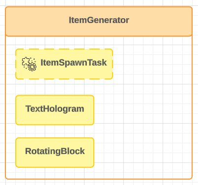

# Kompozycja i dziedziczenie komponentów

## Kompozycja komponentów
Polega na łączeniu komponentów w bardziej złożone, aby stworzyć nową funkcjonalność.



### Przykład kompozycji
`ItemGenerator` używa kompozycji: łączy `RotHologramBlock` (obracający się blok), `Hologram` (tekst) oraz własne zadanie do *generowania przedmiotów*.


Dzięki temu łatwo budujemy nowe funkcje z gotowych komponentów, zamiast pisać wszystko od zera.

#### Kod
```java
public class ItemGenerator extends Controller {
    private final ItemStack spawnItem;
    private final Location location;
    private final Time spawnDelay;
    private final RotHologramBlock rotHologramBlock;
    private final Hologram hologram;

    public ItemGenerator(Component parent, net.kyori.adventure.text.Component label, Location location, ItemStack displayItem, ItemStack spawnItem, Time spawnDelay) {
        super(parent);
        this.spawnItem = spawnItem;
        this.location = location;
        this.spawnDelay = spawnDelay;

        var fallingLocation = location.clone().add(0, 2.9, 0);
        var hologramLocation = location.clone().add(0, 2, 0);

        // W konstruktorze można tworzyć obiekty podrzędne,
        // ale nie można ich jeszcze uruchamiać, bo ten komponent (this)
        // nie został w uruchomiony.
        this.rotHologramBlock = new RotHologramBlock(this, fallingLocation, displayItem);
        this.hologram = new Hologram(this, hologramLocation, label);
    }

    @Override
    public void onComponentInit(ComponentConstructor event) {
        super.onComponentInit(event);
        // W tym momencie komponent (this) został już uruchomiony,
        // więc możemy uruchomić komponenty podrzędne.
        // Craftcontainers automatycznie wyłączy je razem z rodzicem.
        rotHologramBlock.start();
        hologram.start();

        // Uruchamiamy cykliczne zadanie odpowiedzialne za generowanie przedmiotów.
        runTaskTimer(this::spawnItem, spawnDelay, spawnDelay);
    }

    // Prosta metoda odpowiedzialna za pojawianie się przedmiotu na mapie.
    private void spawnItem() {
        final var world = location.getWorld();
        var itemStack = new ItemStack(spawnItem);
        world.dropItem(location, itemStack, i -> {
            i.setVelocity(new Vector(0, 0, 0));
            i.setPickupDelay(0);
            i.setUnlimitedLifetime(false);
        });
    }
}
```

#### Uruchamianie

::: tip
Ten fragment bazuje na przykładzie z [Dynamiczne generowanie mapy](/pl/learn/gamemap-generating.md).
:::

```java
@Override
public void onComponentInit(ComponentConstructor event){
    super.onComponentInit(event);

    // Opcjonalnie przechowuj wszystkie generatory w zbiorze, 
    // aby łatwo nimi zarządzać (np. tymczasowo wyłączyć).
    itemGenerators = new HashSet<ItemGenerator>();
    
    
    for (var location : globalMarkers.getLocationsByName("itemGenerator")) {
        var itemGenerator = new ItemGenerator(
                this,
                Component.text("§b§lGENERATOR"),
                location,
                Material.DIAMOND_BLOCK,
                Material.DIAMOND,
                Time.seconds(1));
        itemGenerators.add(itemGenerator);
        itemGenerator.start();
    }
}
```

## Dziedziczenie
Aby dziedziczenie komponentów było sensowne, muszą być one odpowiednio zaprojektowane pod kątem dziedziczenia.

### Przykład dziedziczenia

#### Główny komponent
`NoPlaceBreak` to komponent służący do kontrolowania możliwości stawiania i niszczenia bloków w grze.
Blokuje interakcję z blokami, dopóki jakaś jego instancja nie zezwoli na wykonanie akcji.

##### Działanie:
- Jeśli chociaż jedna instancja zwróci `true` w metodzie `canPlace(...)` albo `canBreak(...)`, akcja zostanie dozwolona.
- W przeciwnym razie zdarzenie zostanie anulowane (gracz nie może postawić/zniszczyć bloku).


Dzięki temu możesz łatwo tworzyć różne reguły gry — wystarczy dziedziczyć po` NoPlaceBreak` i zmienić logikę `canPlace` lub `canBreak`.

##### Adnotacja @SingletonComponent
Może istnieć maksymalnie jedna instancja obiektu na kontener. Adnotacja nie działa przy dziedziczeniu (rozszerzone klasy traktowane są jako inne komponenty).

```java
@SingletonComponent
public class NoPlaceBreak extends Controller {
    public NoPlaceBreak(Component component) {
        super(component);
    }

    @Override
    public Listeners defineListeners() {
        return super.defineListeners().add(MyListener.class);
    }

    protected boolean canBreak(BlockBreakEvent event) {
        return false;
    }

    protected boolean canPlace(BlockPlaceEvent event) {
        return false;
    }

    private static class MyListener implements AdaptedListener {
        @EventHandler(ignoreCancelled = true)
        public void onBlockPlace(BlockPlaceEvent event) {
            var container = GameMap.getContainerForBlock(event.getBlock());
            var noPlaceBreakComponents = each(container, NoPlaceBreak.class);
            var anyAllowed = noPlaceBreakComponents.stream().anyMatch(noPlaceBreak -> noPlaceBreak.canPlace(event));
            if (!anyAllowed)
                event.setCancelled(true);
        }

        @EventHandler(ignoreCancelled = true)
        public void onBlockBreak(BlockBreakEvent event) {
            var container = GameMap.getContainerForBlock(event.getBlock());
            var noPlaceBreakComponents = each(container, NoPlaceBreak.class);
            var anyAllowed = noPlaceBreakComponents.stream().anyMatch(noPlaceBreak -> noPlaceBreak.canBreak(event));
            if (!anyAllowed)
                event.setCancelled(true);
        }
    }
}
```

#### Komponent podrzędna

```java
public class NoPlaceBreakExcept extends NoPlaceBreak {
    private final Set<Material> allowedMaterials;

    public NoPlaceBreakExcept(Component parent, Collection<Material> allowedMaterials) {
        super(parent);
        this.allowedMaterials = new HashSet<>(allowedMaterials);
    }

    private boolean checkAllowed(Material material) {
        return allowedMaterials.contains(material);
    }

    @Override
    protected boolean canBreak(BlockBreakEvent event) {
        return checkAllowed(event.getBlock().getType());
    }

    @Override
    protected boolean canPlace(BlockPlaceEvent event) {
        return checkAllowed(event.getBlock().getType());
    }
}
```

#### Uruchamianie

```java
 @Override
    public void onComponentInit(ComponentConstructor event){
        super.onComponentInit(event);

        // Z głównego kontenera – blokuje stawianie i niszczenie wszystkiego
        new NoPlaceBreak(this).start();

        // Z BedWarsLogic – blokuje wszystko, ale pozwala na RED_BED
        new NoPlaceBreakE(this,List.of(Material.RED_BED)).start();

        // Z BlockLogic – pozwala niszczyć tylko bloki postawione przez gracza
        new PlayerPlacedBreak(this).start();
}
```

### Dziedziczenie komponentów i przysłonięcie listenera

```java
public class A extends Controller {
    public A(Component component) {
        super(component);
    }

    @Override
    public Listeners defineListeners() {
        // Pobiera listener z klasy bazowej (Controller) i dodaje AListener
        return super.defineListeners().add(AListener.class);
    }

    // Listener specyficzny dla A
    private static class AListener implements AdaptedListener {
        @EventHandler(ignoreCancelled = true)
        public void onBlockBreak(BlockBreakEvent event) {
            var container = GameMap.getContainerForBlock(event.getBlock());
            // Wywołanie logiki tylko dla komponentu A
            first(container, A.class, a -> {
                event.getPlayer().sendMessage("A");
            });
        }
    }
}

// Klasa B – dziedziczy po A, ale przysłania listenery
public class B extends A {
    public B(Component component) {
        super(component);
    }

    @Override
    public Listeners defineListeners() {
        // Zamiast dodawać listener z klasy A, tworzymy własny
        return new Listeners().add(BListener.class);
    }

    // Listener specyficzny dla B
    private static class BListener implements AdaptedListener {
        @EventHandler(ignoreCancelled = true)
        public void onBlockBreak(BlockBreakEvent event) {
            var container = GameMap.getContainerForBlock(event.getBlock());
            // Wywołanie logiki tylko dla komponentu B
            first(container, B.class, a -> {
                event.getPlayer().sendMessage("B");
            });
        }
    }
}
```

#### Output działania listenerów

| Aktywne komponenty | Co wyświetla się w grze                               |
| ------------------ |-------------------------------------------------------|
| A                  | `A`                                                   |
| B                  | `B`                                                   |
| A i B              | `A` i `B` (każdy listener reaguje na swoje zdarzenia) |

