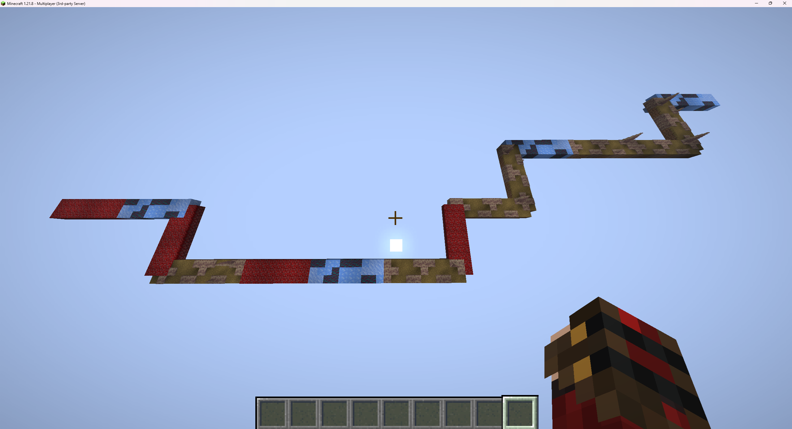
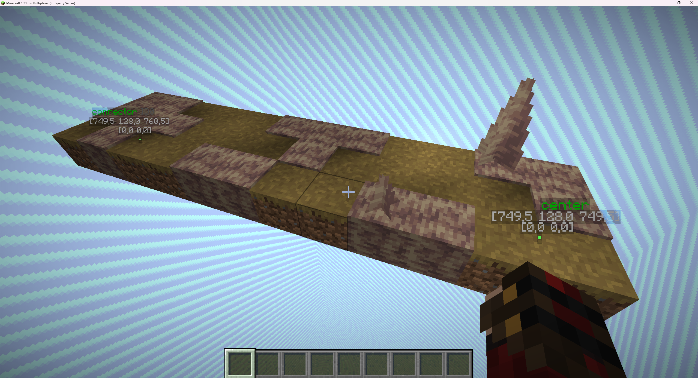

# Generowanie mapy
Klasa `GameMap` wymaga zaimplementowania metody `generate()` i `degenerate()`, które odpowiadają
za stworzenie i zniszczenie mapy.

Korzystając z edytora [Blueprint](/pl/learn/blueprint.md) możesz utworzyć schemat budowli oraz zaznaczyć w nim kluczowe lokacje do których można potem się odwołać w kodzie.


## Przykład statycznego generowania mapy wraz z pobraniem kluczowych lokacji
Ładuje jeden schemat mapy bez żadnych zmian. Efekt jest zawsze taki sam, a kluczowe lokacje pobierane są bezpośrednio ze schematu.

::: warning 
Aby uruchomić ten przykład, musisz utworzyć [blueprint](/pl/learn/blueprint.md) o nazwie `your_plugin_name#your_project_name`.
W blueprintcie powinna istnieć dokładnie jedna lokalizacja `itemGenerator` oraz co najmniej jedna lokalizacja `chest`.
:::

```java
public class MyGameMap extends GameMap {
  private final static String NAME = "mygamemap";
  private final static File SCHEMATIC_FILE = ISchematic.getFile(YourPlugin.getInstance(), NAME);
  private final static File MARKERS_FILE = IMarkers.getFile(YourPlugin.getInstance(), NAME);

  private ISchematic<?> schematic;
  private Markers markers;

  public MyGameMap(@NotNull Container container, @NotNull ISpaceAllocator allocator) {
    super(container, allocator);
  }

  public MyGameMap(@NotNull Container container) {
    super(container, Allocators.defaultRecyclingAllocator());
  }

  @Override
  protected void generate() {
    schematic = Schematics.newMassive(SCHEMATIC_FILE, space(), center());
    schematic.load();

    markers = Markers.read(MARKERS_FILE, center());
  }

  @Override
  protected void degenerate() {
    // Allocator przydziela przestrzeń dla GameMap.
    // Jeśli ponownie używa tego samego obszaru, musisz zadbać o jego wyczyszczenie.
    // Aby tego uniknąć, zdefinuj na sztywno allocator, który automatycznie czyści przestrzeń.  

    // Sprawdzamy czy allokator zamuje się czyszczeniem przestrzeni
    if (!space().requiresCleanup()) return;

    if (schematic != null)
      schematic.clean();
  }

  @Override
  public void onComponentInit(ComponentConstructor event) {
    // Pobieramy unikalny marker dla generatora przedmiotów.
    var itemGeneratorMarker = markers.requireOneByName("itemGenerator");

    // Pobieramy wszystkie lokalizacje oznaczone jako "chest" i ustawiamy tam skrzynie.
    var chestLocations = markers.requireAnyLocationsByName("chest");
    for (var chestLocation : chestLocations)
      chestLocation.getBlock().setType(Material.CHEST);
  }
}
```


## Przykład dynamicznego generowania mapy wraz z pobraniem kluczowych lokacji
Tworzy mapę w locie według algorytmu. Może łączyć wiele struktur, wykonywać na nich transformacje i stosować własne reguły, dzięki czemu każda instancja mapy jest unikalna.

### Przykładowy algorytm



```java
public class TestGameMap extends GameMap {
    private final static Random RANDOM = new Random();
    // Liczba pokoi, które będą wygenerowane na mapie.
    private final int ROOM_COUNT = 15;
    // Lista nazw dostępnych pokoi.
    private final static List<String> ROOM_NAMES = List.of("room1", "room2", "room3");
    // Lista plików schematów odpowiadających pokojom.
    private final static List<File> ROOM_SCHEMATIC_FILES = new ArrayList<>();
    // Lista plików markerów odpowiadających pokojom.
    private final static List<File> ROOM_MARKER_FILES = new ArrayList<>();
    // Zbiór wczytanych schematów, które należy później oczyścić.
    private Set<ISchematic<?>> loadedSchematics = new HashSet<>();
    // Połączony obiekt kluczowych lokacji ze wszystkich schematów.
    private IMarkers<?> globalMarkers = null;
    // Obecny kierunek rotacji przy generowaniu mapy. 
    private CurrentRotation currentRotation = CurrentRotation.FORWARD;

    static {
        // Wczytanie plików schematów i markerów dla wszystkich nazw pokoi
        ROOM_NAMES.forEach(roomName -> {
            ROOM_SCHEMATIC_FILES.add(ISchematic.getFile(CraftContainers.instance(), roomName));
            ROOM_MARKER_FILES.add(IMarkers.getFile(CraftContainers.instance(), roomName));
        });
    }

    public TestGameMap(@NotNull Container container, ISpaceAllocator allocator) {
        super(container, allocator);
    }

    public TestGameMap(@NotNull Container container) {
        super(container, Allocators.defaultRecyclingAllocator());
    }

    // Losuje indeks pokoju z listy dostępnych nazw.
    private int randomRoomIndex() {
        return RANDOM.nextInt(ROOM_NAMES.size());
    }

    // Tworzy schemat pokoju na podstawie indeksu i punktu początkowego.
    private ISchematic<?> schematicByIndex(int index, Location origin) {
        var file = ROOM_SCHEMATIC_FILES.get(index);
        return Schematics.newMassive(file, space(), origin);
    }

    // Tworzy markery pokoju na podstawie indeksu i punktu początkowego.
    private IMarkers<?> markersByIndex(int index, Location origin) {
        var file = ROOM_MARKER_FILES.get(index);
        return Markers.read(file, origin);
    }

    // Określa kolejny kierunek rotacji schematu w zależności od obecnego kierunku.
    private CurrentRotation nextRotation() {
        switch (currentRotation) {
            case FORWARD -> {
                return currentRotation = RANDOM.nextBoolean() ? CurrentRotation.LEFT : CurrentRotation.RIGHT;
            }
            case LEFT, RIGHT -> {
                return currentRotation = CurrentRotation.FORWARD;
            }
            default -> throw new IllegalStateException();
        }
    }

    @Override
    protected void generate() {
        // Tworzymy globalne markery mapy (center() nie jest dostępne w konstruktorze)
        globalMarkers = new Markers(center());

        var origin = space().getCenter();

        for (int i = 0; i < ROOM_COUNT; i++) {
            // Wylosuj pokój
            var index = randomRoomIndex();
            var schematic = schematicByIndex(index, origin);
            var markers = markersByIndex(index, origin);

            // Losowa rotacja schematu (nie cofamy względem początkowego kierunku)
            if (RANDOM.nextBoolean()) {
                var rotation = nextRotation();
                if (rotation != CurrentRotation.FORWARD) {
                    var direction = rotation == CurrentRotation.LEFT ? Rotation.COUNTER : Rotation.CLOCKWISE;
                    schematic = schematic.rotate(Degree.DEG_90, direction, RotAxis.YAW_Y);
                    markers = markers.rotate(Degree.DEG_90, direction, RotAxis.YAW_Y);
                }
            }

            // Załaduj schemat i dodaj do zbioru w celu późniejszego czyszczenia
            schematic.load();
            loadedSchematics.add(schematic);

            // Dodaj markery schematu do globalnych markerów mapy
            globalMarkers.createFrom(markers);

            // Ustaw punkt wklejania następnego pokoju na "connector" obecnego schematu
            origin = markers.requireOneLocationByName("connector");
        }
    }

    @Override
    protected void degenerate() {
        // Jeżeli alokator nie wymaga czyszczenia, zakończ metodę
        if (!space().requiresCleanup()) return;

        for (var schematic : loadedSchematics)
            schematic.clean();

        loadedSchematics.clear();
    }
}
```

#### Pojedynczy blueprint
W każdej strukturze należy oznaczyć punkt łączenia, w którym można podłączyć kolejny schemat.

