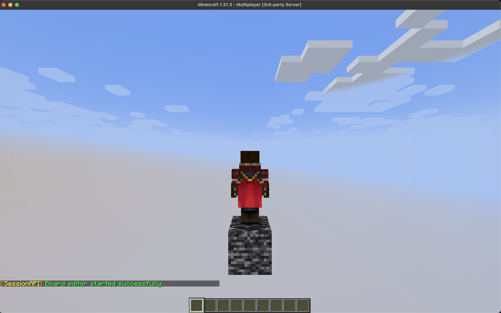

# Kreator map
Kreator map to wbudowane narzędzie umożliwiające modyfikację budowli na mapie.
Został zaprojektowany tak, aby mógł z niego korzystać każdy, nawet bez umiejętności programowania.
Pozwala na tworzenie nowych szablonów map sesji oraz edycję istniejących.

## Uruchamianie kreatora
Aby uruchomić kreator, należy podać katalog, z którego będzie korzystał.
Jeśli katalog istnieje, zostanie załadowany jego szablon. W przeciwnym razie zostanie utworzony nowy, pusty szablon mapy.

```/board-edit <nazwa katalogu szablonu>```

::: tip Domyślne nazwy katalogów
Domyślnie komponent Board próbuje załadować szablon znajdujący się pod ścieżką:
```/plugins/SessionAPI/board/<nazwa klasy>B#<nazwa pluginu>```
:::

**Przykład:**
- Nazwa klasy Board: `Arena`
- Nazwa naszego pluginu: `BedWars`
- Domyślna nazwa katalogu szablonu: `ArenaB#BedWars`

**Aby otworzyć kreator powiązany z daną mapą, należy wykonać polecenie:**
```/board-edit ArenaB#BedWars```



*W przypadku braku szablonu zostanie utworzony nowy, domyślny szablon.*


## Zmiana domyślnej ścieżki szablonu
Domyślna ścieżka szablonu zawsze rozpoczyna się od `/plugins/SessionAPI/`. Końcową część katalogu można zdefiniować za pomocą metody **defineDirectoryPath()**.

Jest to przydatne w sytuacjach, gdy kilka map powinno korzystać z tego samego szablonu lub gdy katalog szablonu musi być dynamicznie określany.

```java
// Arena.java (extends Board)
@Override
public String defineDirectoryPath() {
    return "board/Arena";
}
```
W powyższym przykładzie mapa będzie korzystać z katalogu `/plugins/SessionAPI/board/Arena`.
Aby edytować ten szablon, należy wykonać: `/board-edit Arena`.


:::warning Kolizja katalogów
Upewnij się, że nazwy katalogów nie kolidują z innymi pluginami. Jeśli dwa projekty używają tej samej nazwy szablonu (np. Arena), będą korzystać z tego samego zasobu.
:::

## Kluczowe lokalizacje
Kreator umożliwia zapisanie kluczowych lokalizacji na mapie. Aby je oznaczyć, należy umieścić tabliczkę z napisem `@<nazwa>` w pierwszym wierszu.


**W kodzie można uzyskać dostęp do oznaczonych lokalizacji:**
```java
// Arena.java (extends Board)
@Override
public void onComponentInit(ComponentConstructor event) {
    super.onComponentInit(event);
    // Pobranie wszystkich lokalizacji oznaczonych jako '@npc'
    var npcLocations = tags("npc").locations();

    // Pobranie pierwszej lokalizacji oznaczonej jako '@zombie'
    var zombieLocation = tags("zombie").firstLocation();
}
```

::: tip Wsparcie wielu instancji
Każda instancja mapy działa w innych koordynatach globalnych, więc *kluczowe lokacje* mają różne położenie.
Framework zapisuje je relatywnie *(względem środka)* i dodaje off-set przy uruchomieniu, aby zachować spójność pozycji.
:::

## Zapis mapy

Aby zapisać mapę, użyj polecenia `/board-save` w kreatorze.


### Optymalizacja zapisu
Aby zwiększyć wydajność ładowania, mapa jest minimalizowana.
Domyślny rozmiar `300x384x300` zostaje ograniczony do faktycznych wymiarów budowli `10x5x10`, co redukuje jej objętość o ponad `99%`.


Po optymalizacji wyliczany jest środek mapy, analizowane są tabliczki z kluczowymi lokalizacjami i generowane są schematy.


### Pliki wynikowe
* `constructor.schem` – schemat mapy, wymagany do jej budowy
* `destructor.schem` – pusty schemat, potrzebny do usunięcia mapy
* `tags.bin` – zapis kluczowych lokalizacji, umożliwiający szybkie wczytywanie

## Zamykanie kreatora
Aby zamknąć kreator bez zapisu lub opuścić zapisany projekt, użyj `/board-exit`.

::: warning
Polecenie kończy edycję mapy. Jeśli chcesz zachować zmiany, najpierw zapisz mapę poleceniem `/board-save`.
:::

