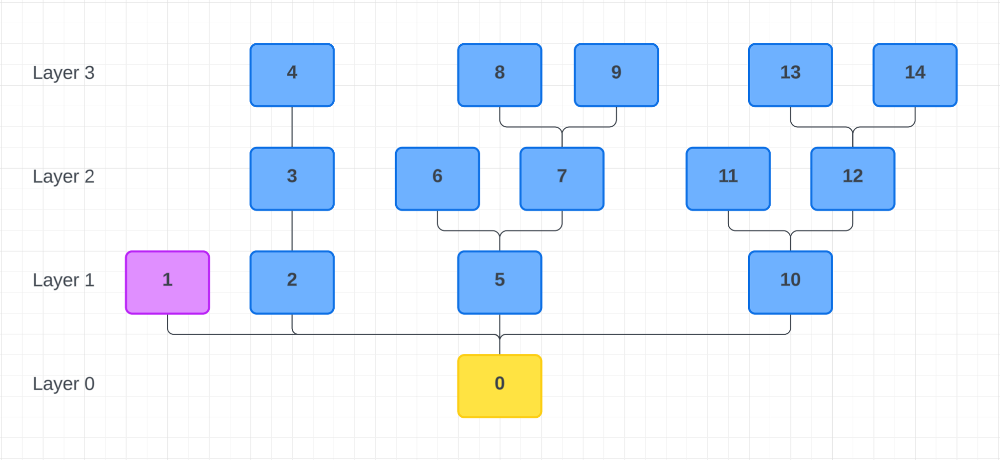
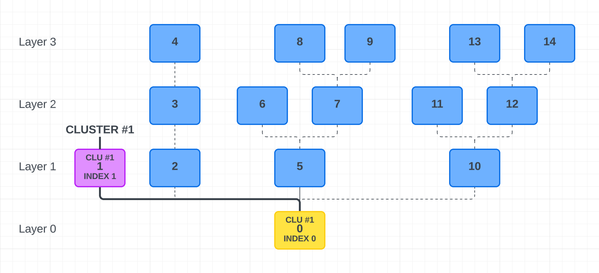
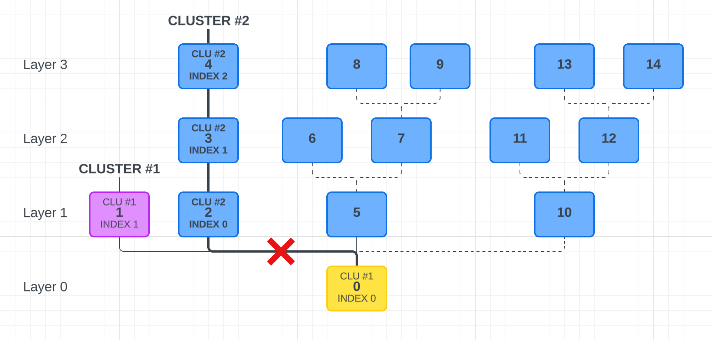
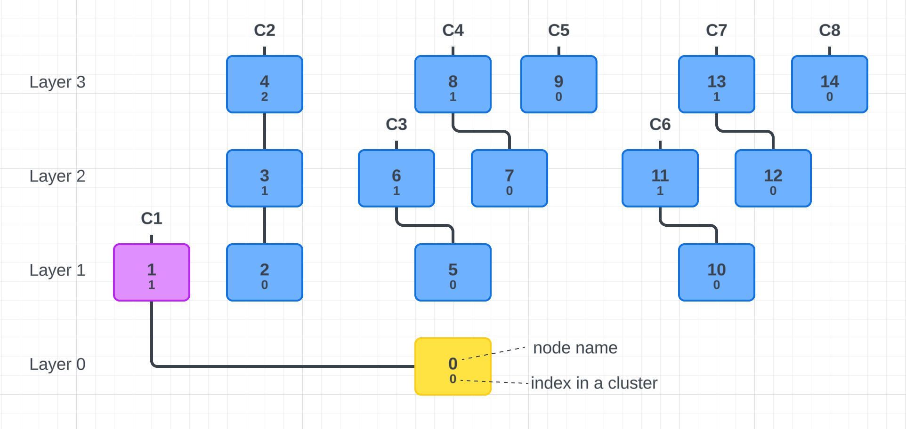
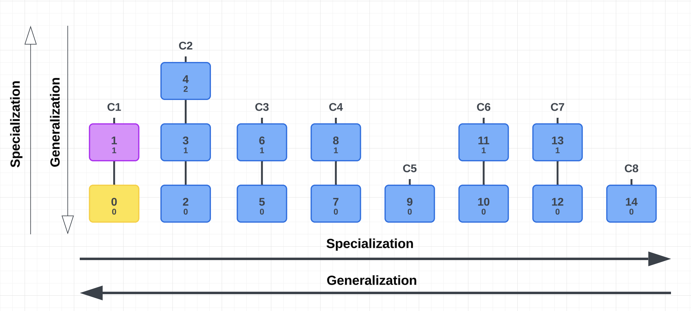
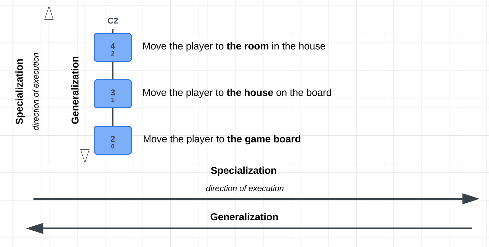
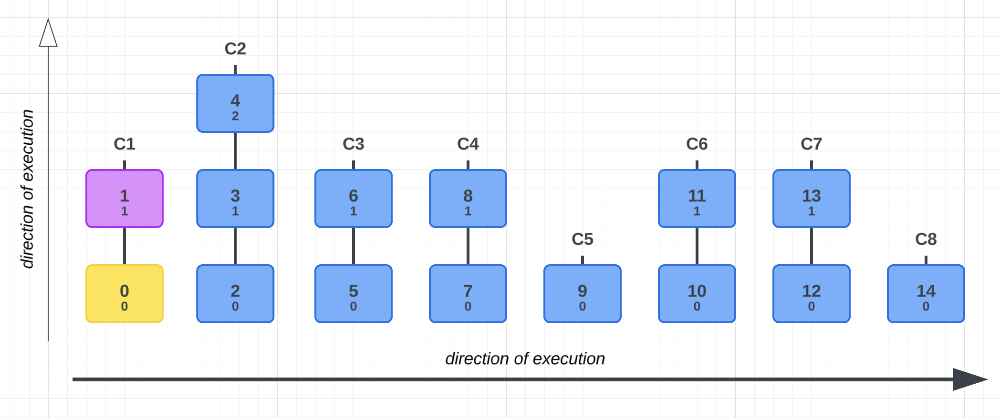
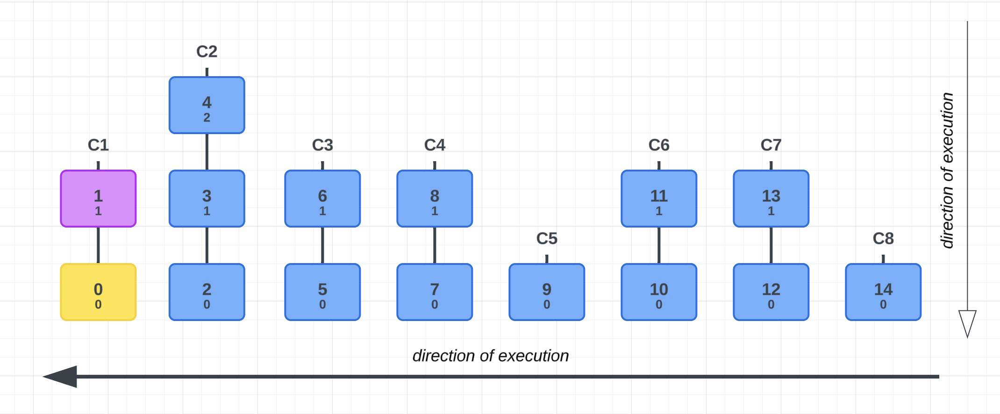

# Zdarzenia w zagnieżdżonych drzewach komponentów
Drzewo komponentów powstaje na skutek rekurencyjnego uruchamiania dzieci przez komponenty nadrzędne.

    
Fragment wykonywania

- **0** uruchamia `1`
- **1** *nie uruchamia nic*
- **0** uruchamia `2`
- **2** uruchamia `3`
- **3** uruchamia `4`
- **4** *nie uruchamia nic*
- **0** uruchamia `5`
- ...

Pomimo że komponent **0** chciałby uruchomić wszystkie komponenty z `Layer 1` jednocześnie, inicjalizacja odbywa się w sposób rekurencyjny – każdy komponent może wyzwalać kolejne.

## Grupowanie komponentów (Generalizacja-Specyfikacja)
Kolejność przetwarzania zdarzeń wewnętrznych zależy od indeksu klastra, do którego trafił komponent, oraz jego pozycji w tym klastrze.

### Pierwszy krok grupowania:

### Drugi krok grupowania:

### Ukończone grupowanie:
Dla każdego komponentu, który nic nie uruchamia, tworzony jest klaster. Algorytm schodzi w dół i przypisuje każdego nadrzędnego komponentu do klastra, jeśli nie został jeszcze przyporządkowany.

## Generalizacji-specyfikacja
Generalizacja i specjalizacja określają kierunek wykonywania operacji w strukturze drzewa.
- **Specjalizacja** – przetwarzanie w górę drzewa, od ogólnych komponentów do bardziej szczegółowych.
- **Generalizacja** – przetwarzanie w głąb drzewa, od komponentów szczegółowych do bardziej ogólnych.

## Uruchamianie komponentów: `onComponentInit` oraz `onPlayerInit`
Inicjalizacja komponentów odbywa się w kierunku **specjalizacji**.

### Proces inicjalizacji
- Przechodzimy przez wszystkie klastry i każdy komponent w klastrze.
- Uruchamiamy `onComponentInit` dla każdego komponentu.
- Po zakończeniu, powtarzemy operację, uruchamiając `onPlayerInit` dla każdego komponentu i gracza.

::: tip Zasada cyklu życia komponentu
1. Tworzymy zasoby → `onComponentInit`
2. Dodajemy stan graczy → `onPlayerInit`
:::

    
Fragment wykonywania

**Klaster 1:**
- **0:** `onComponentInit`
- **1:** `onComponentInit`
- **0:** `onPlayerInit`
- **1:** `onPlayerInit`

**Klaster 2:**
- **2:** `onComponentInit`
- **3:** `onComponentInit`
- **4:** `onComponentInit`
- **2:** `onPlayerInit`
- **3:** `onPlayerInit`
- **4:** `onPlayerInit`

**Klaster 3:**
- ...

## Wyłączanie komponentów: `onPlayerDestroy` oraz `onComponentDestroy`
Wyłączanie komponentów odbywa się w kierunku **generalizacji**, czyli odwrotnie do inicjalizacji.

::: tip Zasada cyklu życia komponentu
1. Usuwamy stan graczy → `onPlayerDestroy`
2. Niszczymy zasoby → `onComponentDestroy`
:::

## Dodawanie gracza do sesji
Dodawanie gracza do sesji odbywa się w kierunku **specjalizacji**.

## Usuwanie gracza z sesji
Usuwanie gracza z sesji odbywa się w kierunku **generalizacji**.

## Modyfikacja drzewa w czasie rzeczywistym
Drzewo komponentów jest dynamiczne. W trakcie działania sesji możemy uruchamiać i wyłączać komponenty lub fragmenty drzewa.

### Uruchamianie nowych fragmentów drzewa
Jeśli dołączymy nowe komponenty w trakcie działania, zostaną one uruchomione zgodnie z algorytmem `Uruchamianie komponentów`, ale tylko w obrębie nowej gałęzi drzewa.
Zdarzenia będą wykonywane w kierunku **specjalizacji**.

### Wyłączanie fragmentów drzewa
Jeśli wyłączamy komponent posiadający komponenty podrzędne, zostanie uruchomiony algorytm `Wyłączanie komponentów`, ale tylko w obrębie danej gałęzi drzewa.
Algorytm wyłączy komponent oraz wszystkie jego komponenty podrzędne. Operacje te będą wykonywane w kierunku **generalizacji**.