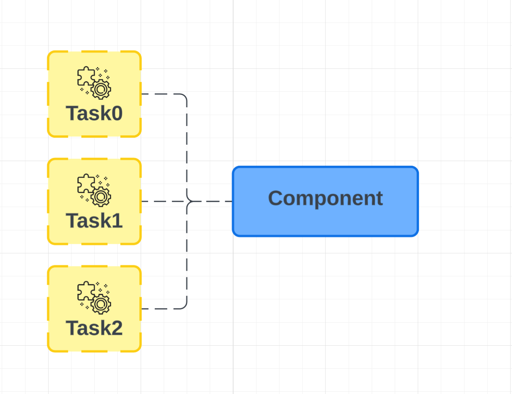

# Zarządzanie zadaniami i wątkami
Framework umożliwia uruchamianie **zadań Bukkit** przypisanych do komponentów.
Gdy komponent zostanie wyłączony, wszystkie powiązane z nim zadania zostaną automatycznie anulowane.



## Uruchamianie zadania
Zadania można uruchamiać od momentu inicjalizacji komponentu, co jest określone przez zdarzenie `onComponentInit`.


### Przykład


```java
private Location spawnLocation;
private int counter = 0;

@Override
public void onComponentInit(ComponentConstructor event) {
    super.onComponentInit(event);

    var board = board();
    if (board == null) return;

    // Pobranie lokalizacji spawnu na podstawie tagu "spawn"
    var spawnTag = board.tags("spawn");
    spawnLocation = spawnTag.firstCentredXZ();

    // Uruchomienie cyklicznego zadania spawnującego zombie co 2 sekundy
    runTaskTimer(this::spawn, Time.seconds(2), Time.seconds(2));
}

private void spawn() {
    if (spawnLocation == null) return;

    var world = spawnLocation.getWorld();
    var zombieNumber = counter++;

    world.spawn(spawnLocation, Zombie.class, zombie -> {
        zombie.setCustomNameVisible(true);
        zombie.customName(Component.text(zombieNumber));
    });

    // Powiadomienie graczy o nowym zombie
    Bukkit.broadcast(Component.text("§eSpawned zombie (#" + zombieNumber + ")"));
}
```

::: tip Automatyczne zarządzanie zadaniami
Framework monitoruje cykl życia komponentów oraz aktywne zadania.
Gdy komponent zostanie wyłączony, wszystkie przypisane do niego zadania zostaną anulowane.
:::

## Przerywanie zadania
Każda metoda uruchamiająca zadanie zwraca obiekt zadania, który pozwala na jego anulowanie lub kontrolowanie.

### Przykład:
```java
@Override
public void onComponentInit(ComponentConstructor event) {
    super.onComponentInit(event);

    var myTask = runTaskTimer(() -> {
        // Kod wykonywanego zadania
    }, Time.zero(), Time.seconds(1));

    // Anulowanie zadania
    myTask.cancel();
}
```

## Typy zadań
Framework udostępnia kilka metod uruchamiania zadań:

- **`runTask(runnable)`** - uruchamia zadanie w głównym wątku serwera.


- **`runTaskAsync(runnable)`** - uruchamia zadanie w osobnym wątku.


- **`runTaskLater(runnable, delay)`** - uruchamia zadanie w głównym wątku po określonym czasie.


- **`runTaskLaterAsync(runnable, delay)`** - uruchamia zadanie w osobnym wątku po określonym czasie.


- **`runTaskTimer(runnable, delay, interval)`** - uruchamia zadanie w głównym wątku po określonym czasie i powtarza je cyklicznie.


- **`runTaskTimerAsync(runnable, delay, interval)`** - uruchamia zadanie w osobnym wątku po określonym czasie i powtarza je cyklicznie.


::: warning Ważne!
Podczas wyłączania komponentu (`onComponentDestroy`), nie należy inicjalizować nowych zadań.
:::

